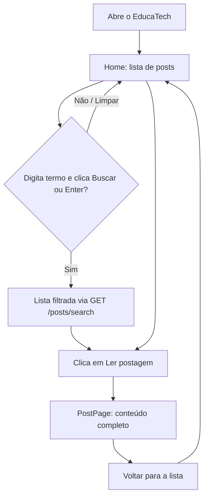
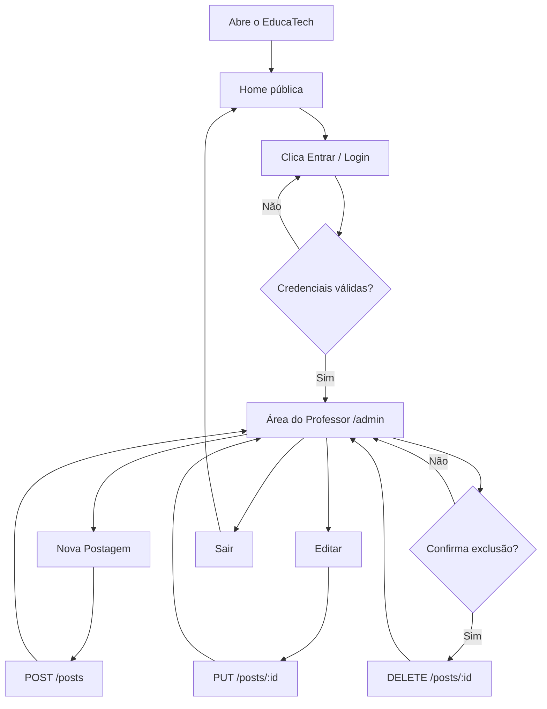

# EducaTech FIAP — Documentação (Fase 3)

**Autora:** Amanda Abila Melo (RM 373430)  
**Curso:** FIAP Pós Tech — Full Stack Development  
**Data:** Setembro/2026

---

## 1. O que é o sistema

O EducaTech é uma plataforma de blogging educacional: professores publicam conteúdos e alunos consultam as postagens.

- **Fase 1:** front-end em OutSystems.
- **Fase 2:** back-end em Node.js + PostgreSQL, com API REST e UI Flows no formato OutSystems.
- **Fase 3 (esta entrega):** interface gráfica em React consumindo a API REST da Fase 2.

Esta pasta contém as duas partes: o back-end na raiz (`src/`, `tests/`) e o front-end em `frontend/`. O back-end foi mantido como estava na Fase 2 — as únicas mudanças foram de infraestrutura (Docker Compose, CI e documentação) para acomodar o novo serviço web.

**Tecnologias do front-end:** React 18, Vite 5, React Router 6, Styled Components 6, Context API, Nginx (produção).

> A stack permanece em **Vite + React**, alinhada ao Tech Challenge (interface React + REST). Next.js aparece nas aulas da fase, mas não é exigência da entrega.

---

## 1.1 Personas (aula de Personas / requisitos)

Duas personas guiaram as telas e a prioridade das funcionalidades:

### Persona 1 — Ana, professora

| Campo | Detalhe |
|-------|---------|
| Perfil | Professora de educação digital, 38 anos |
| Objetivo | Publicar e atualizar conteúdos para a turma com pouco atrito |
| Necessidades | Login simples, área administrativa clara, criar/editar/excluir posts |
| Frustrações | Perder o rascunho, não achar o botão de editar, exclusão acidental |
| O que o app oferece | `/login`, `/admin`, formulário de criação/edição, confirmação antes de excluir |

### Persona 2 — Lucas, aluno

| Campo | Detalhe |
|-------|---------|
| Perfil | Aluno do ensino médio, 16 anos, acessa pelo celular |
| Objetivo | Encontrar a aula do dia e ler o conteúdo completo |
| Necessidades | Lista legível, busca por palavra-chave, leitura sem cadastro |
| Frustrações | Tela confusa, busca que “busca sozinha” sem querer, texto pequeno |
| O que o app oferece | Home pública, busca com botão **Buscar** / Enter, página de leitura, layout responsivo |

**Priorização:** o aluno entra direto na Home (leitura); o professor só acessa criação, edição e admin depois do login.

---

## 1.2 User flows (aula de User Flow)

Os fluxos abaixo espelham o que seria desenhado no Figma e o que o React Router implementa.

### Jornada do aluno (público)



### Jornada do professor (autenticado)



Rotas protegidas (`/admin`, `/admin/posts/novo`, `/admin/posts/:id/editar`) redirecionam para `/login` se não houver sessão.

---

## 1.3 Style guide mínimo (aula de Style Guides)

O Brand/Style Guide da interface vive no código em `frontend/src/styles/theme.js`, `GlobalStyle.js` e `ui.js`. Resumo para a equipe:

### Cores (`theme.colors`)

| Token | Hex | Uso |
|-------|-----|-----|
| `primary` | `#1d4ed8` | Links, botão principal |
| `primaryDark` | `#1e3a8a` | Header, títulos |
| `primaryLight` | `#dbeafe` | Tags, fundos de destaque |
| `accent` | `#0f766e` | Foco (`:focus-visible`) |
| `danger` / `dangerLight` | `#b91c1c` / `#fee2e2` | Excluir e erros |
| `success` / `successLight` | `#15803d` / `#dcfce7` | Mensagens de sucesso |
| `background` | `#f4f6fb` | Fundo da página |
| `surface` | `#ffffff` | Cards, formulários |
| `border` | `#d8dee9` | Bordas |
| `text` / `textMuted` | `#1f2933` / `#5b6672` | Texto principal e secundário |

### Tipografia

Escolhemos a stack de sistema documentada no `GlobalStyle`:

`'Segoe UI', Roboto, 'Helvetica Neue', Arial, sans-serif`

Motivo: legibilidade boa em Windows/Android/iOS, sem depender de fonte externa (carregamento mais simples para entrega acadêmica). Títulos usam `primaryDark`; corpo usa `text` em tamanho base `1rem` e entrelinha `1.6`.

### Componentes de UI (`styles/ui.js`)

- **Botões:** `primary` (ação principal), `secondary` (cancelar/voltar), `danger` (excluir).
- **Cards:** fundo `surface`, borda, sombra leve (`shadows.sm`), raio `10px`.
- **Campos:** label acima do input, borda `border`, foco com anel `accent`.
- **Tags:** pílula `primaryLight` para matéria.

### Breakpoints e layout

| Token | Valor | Comportamento |
|-------|-------|---------------|
| `mobile` | `600px` | Menu em coluna, grade de posts em 1 coluna, padding menor |
| `tablet` | `900px` | Disponível no tema para ajustes intermediários |
| `container` | `1080px` | Largura máxima do conteúdo |

Responsividade: grade `auto-fill` na Home; tabela do admin com `overflow-x: auto` no celular.

### Prototipação (aula de Prototipação)

O fluxo foi validado primeiro como mapa de telas (user flows acima) e depois implementado em React. Wireframes de baixa fidelidade → telas reais com o style guide. Não há dependência de Next.js; o protótipo navegável de produção é a própria SPA Vite.

---

## 2. Arquitetura

### Visão geral

```
Navegador
   │
   ├── React Router  →  Páginas (pages/)  →  Componentes (components/)
   │                          │
   │                          ├── AuthContext  →  localStorage (sessão do professor)
   │                          └── services/api.js  →  fetch
   │                                                    │
   └────────────────────────────────────────────────────┴──→ API Express (:3000) → PostgreSQL
```

Em desenvolvimento, o Vite faz proxy de `/api` para a API. Em produção (Docker), o Nginx serve os arquivos estáticos e encaminha `/api/` para o contêiner `api`.

### Camadas do front-end

| Camada | Arquivo/pasta | Função |
|--------|---------------|--------|
| Entrada | `src/main.jsx` | Monta o app com `ThemeProvider`, `GlobalStyle`, `BrowserRouter` e `AuthProvider` |
| Rotas e layout | `src/App.jsx` | Declara as rotas e envolve as privadas em `ProtectedRoute` |
| Páginas | `src/pages/` | Uma por tela do requisito: Home, leitura, login, admin, criação, edição, 404 |
| Componentes | `src/components/` | Header, Footer, PostCard, SearchBar, PostForm, Loading, ErrorMessage, EmptyState |
| Estado global | `src/contexts/AuthContext.jsx` | Sessão do professor com Context API |
| Comunicação | `src/services/api.js` | Wrapper de `fetch` com tratamento de erro e do 204 |
| Estilo | `src/styles/` | `theme.js` (design tokens), `GlobalStyle.js` (reset), `ui.js` (botões, cards, campos) |
| Utilitários | `src/utils/format.js` | Formatação de datas e resumo de conteúdo |

### Telas e requisitos atendidos

| Requisito da Fase 3 | Onde foi implementado |
|---------------------|-----------------------|
| Página principal com lista e busca | `pages/HomePage.jsx` + `components/SearchBar.jsx` e `PostCard.jsx` |
| Página de leitura do post | `pages/PostPage.jsx` |
| Página de criação | `pages/CreatePostPage.jsx` + `components/PostForm.jsx` |
| Página de edição | `pages/EditPostPage.jsx` (carrega os dados atuais antes de editar) |
| Página administrativa | `pages/AdminPage.jsx` (tabela com editar e excluir) |
| Autenticação e autorização | `contexts/AuthContext.jsx` + `components/ProtectedRoute.jsx` |
| Hooks e componentes funcionais | Todo o `frontend/src` |
| Styled Components e responsividade | `styles/` e media queries em cada componente |
| Integração REST | `services/api.js` |

### Integração com a API

| Ação na interface | Chamada |
|-------------------|---------|
| Listar postagens | `GET /posts` |
| Buscar | `GET /posts/search?q=termo` |
| Abrir postagem | `GET /posts/:id` |
| Publicar | `POST /posts` |
| Salvar edição | `PUT /posts/:id` |
| Excluir | `DELETE /posts/:id` (204) |

O contrato usa `title`, `content`, `author` e `subject`; erros chegam como `{ "error": "mensagem" }` e são exibidos na própria tela, com botão de "Tentar novamente" quando a falha é de leitura.

Detalhe importante: a rota de busca devolve **400** quando `q` vem vazio. Por isso a Home só chama `/posts/search` depois que o usuário confirma a busca (botão **Buscar** ou Enter) com texto preenchido; campo vazio ou **Limpar** volta para `GET /posts`.

### Autenticação

O back-end não tem login (a rota `/Login` da Fase 1 responde 503). Nesta fase a autenticação foi feita no cliente:

1. `LoginPage` envia e-mail e senha para `AuthContext.login`.
2. O contexto compara com as variáveis `VITE_AUTH_EMAIL` / `VITE_AUTH_PASSWORD` e, se conferem, grava a sessão em `localStorage`.
3. `ProtectedRoute` bloqueia `/admin`, `/admin/posts/novo` e `/admin/posts/:id/editar` para visitantes, redirecionando para `/login` e guardando a rota de origem.
4. O `Header` reflete o estado da sessão e oferece "Sair".

É um controle de navegação, não de segurança: a API continua aberta. A evolução natural é mover a autenticação para o back-end com JWT e proteger os métodos de escrita.

### Infraestrutura

- **Docker Compose:** três serviços — `db` (PostgreSQL 16), `api` (Express na 3000) e `web` (build React servido por Nginx na 8080), além do perfil `test`.
- **Front-end em produção:** build multi-stage (Node para compilar, Nginx para servir), com fallback SPA e proxy de `/api`.
- **GitHub Actions:** jobs de testes do back-end, build do front-end e build das imagens Docker.

---

## 3. Como usar

### Rodar com Docker (recomendado)

```powershell
copy .env.example .env
docker compose up --build
```

| Endereço | Uso |
|----------|-----|
| http://localhost:8080 | Front-end React |
| http://localhost:3000 | API |
| http://localhost:3000/api-docs | Swagger |
| http://localhost:3000/health | Verificar API e banco |

### Rodar em desenvolvimento

```powershell
npm install
docker compose up -d db
npm start

cd frontend
npm install
npm run dev
```

Front-end em http://localhost:5173 com proxy para a API.

### Fluxo de uso

**Aluno:** abre a página inicial, busca por palavra-chave e clica na postagem para ler o conteúdo completo.

**Professor:** entra com `professor@educatech.com` / `educatech123`, acessa a Área do Professor, cria postagens, edita conteúdos existentes e exclui postagens (com confirmação nativa do navegador).

### Testes

```powershell
npm test                 # back-end (Jest + PostgreSQL)
npm run frontend:build   # valida o build do front-end
```

### Problemas comuns

| Problema | Solução |
|----------|---------|
| Lista vazia com aviso de conexão | A API não está no ar; verifique http://localhost:3000/health |
| Erro de CORS em desenvolvimento | Use o endereço do Vite (5173) para que o proxy `/api` seja aplicado |
| Porta 8080 ocupada | Ajuste o mapeamento do serviço `web` no `docker-compose.yml` |
| Login não aceita as credenciais | Confira `VITE_AUTH_EMAIL` e `VITE_AUTH_PASSWORD` em `frontend/.env` |
| Dados antigos no banco | `docker compose down -v && docker compose up --build` |

---

## 4. Experiências e desafios no desenvolvimento

### Contexto

A Fase 3 pediu uma interface React para a API construída na Fase 2, atendendo dois perfis bem diferentes: alunos, que só leem, e professores, que gerenciam o conteúdo.

### Principais desafios

**1. Busca previsível (sem disparar a cada tecla)**  
`GET /posts/search` retorna 400 quando `q` está em branco. Em vez de debounce a cada digitação, a Home lista com `GET /posts` no carregamento e só busca quando o usuário clica em **Buscar** ou pressiona Enter — alinhado à usabilidade vista nas aulas (ação explícita, menos surpresa).

**2. Respostas em dois formatos**  
`GET /posts` devolve um array simples, mas com `?page` e `?limit` devolve `{ items, page, total… }`. As telas normalizam o retorno (`Array.isArray(data) ? data : data.items`).

**3. Estados de carregamento e erro repetidos**  
Cada página precisava tratar "carregando", "deu erro" e "não há nada aqui". Foram criados `Loading`, `ErrorMessage` e `EmptyState`, reutilizados nas telas.

**4. Pessoas e fluxos antes do código**  
Com as personas Ana (professora) e Lucas (aluno), ficou claro o que é público e o que exige login. Os user flows em Mermaid documentam a jornada e batem com as rotas do React Router.

**5. Proteger as telas sem back-end de autenticação**  
A sessão ficou no `localStorage` com o `AuthContext`. Isso protege a navegação, não os dados da API; a evolução natural seria JWT no back-end.

**6. Servir uma SPA em produção**  
No Nginx, `try_files $uri $uri/ /index.html` evita 404 ao atualizar `/admin`. O proxy `/api` aponta para o contêiner da API.

**7. Um único ponto de contato com a API**  
`services/api.js` concentra `fetch`, o 204 do DELETE e a mensagem `{ error }`.

**8. Responsividade do cabeçalho e da tabela**  
Menu colapsado abaixo de 600 px e rolagem horizontal na tabela administrativa.

### O que aprendi

- Ler o contrato da API antes de codificar evita retrabalho: os detalhes (400 na busca vazia, 204 no delete) definem o comportamento da interface.
- Componentes pequenos e reutilizáveis para estados de tela reduzem muito o código das páginas.
- Context API já resolve bem um estado global simples como a sessão, sem precisar de Redux.
- Publicar uma SPA exige pensar no servidor: o fallback para `index.html` é tão importante quanto o código React.

---

## 5. Estrutura do projeto

```
(raiz = back-end da Fase 2)
src/                         # API Express
tests/                       # Testes Jest
Dockerfile                   # Imagem da API
docker-compose.yml           # db + api + web
.github/workflows/ci.yml     # CI/CD

frontend/
├── index.html, vite.config.js
├── Dockerfile, nginx.conf
└── src/
    ├── main.jsx, App.jsx
    ├── pages/               # Home, Post, Login, Admin, Create, Edit, NotFound
    ├── components/          # Header, Footer, PostCard, SearchBar, PostForm…
    ├── contexts/            # AuthContext
    ├── services/            # api.js
    ├── styles/              # theme.js, GlobalStyle.js, ui.js
    └── utils/               # format.js
```

---

*Tech Challenge — Fase 3 do EducaTech FIAP.*
